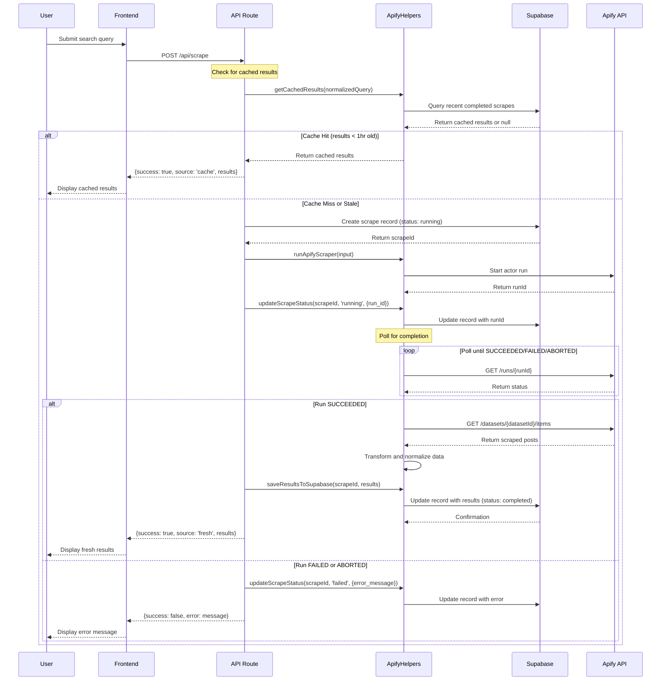

# Reddit Scraping Pipeline Architecture

## Overview

This document describes the end-to-end architecture of the Reddit scraping pipeline, including data flow, caching strategy, and error handling mechanisms.

## Architecture Diagram



## Key Components

### 1. Frontend Components
- **Home Page (`/`)**: Landing page with navigation to search
- **Search Page (`/search`)**: Direct search interface
- **Results Page (`/results`)**: Displays search results with caching awareness

### 2. API Route (`/api/scrape`)
- **Purpose**: Single endpoint for all scraping operations
- **Authentication**: Uses service role for server-side operations
- **Response Format**: Consistent JSON structure with success/error states

### 3. Apify Helpers (`lib/apify-helpers.ts`)
- **Centralized Logic**: Single source of truth for Apify operations
- **Query Normalization**: Consistent caching key generation
- **Error Handling**: Comprehensive error mapping and logging
- **Dataset Retrieval**: Uses `defaultDatasetId` for reliable data access

### 4. Database Layer (Supabase)
- **Table**: `reddit_scrapes` with proper indexing and RLS
- **Security**: Service role for writes, anon role for reads
- **Caching**: Time-based freshness (1 hour default)

## Data Flow

### 1. Request Processing
1. Frontend submits search query to `/api/scrape`
2. API route normalizes query using `normalizeQuery()`
3. Checks for fresh cached results (< 1 hour old)
4. Returns cached results if available, otherwise proceeds

### 2. Scraping Execution
1. Creates new scrape record with `status: 'running'`
2. Starts Apify actor with normalized query
3. Updates record with `run_id` for tracking
4. Polls run status until completion

### 3. Result Processing
1. On success: Retrieves dataset using `defaultDatasetId`
2. Transforms data to consistent `RedditPost` format
3. Updates database with results and `status: 'completed'`
4. Returns fresh results to frontend

### 4. Error Handling
1. On failure: Updates record with error details
2. Returns structured error response
3. Frontend displays user-friendly error messages

## Caching Strategy

### Query Normalization
```typescript
function normalizeQuery(query: string): string {
  return query
    .trim()
    .toLowerCase()
    .replace(/\s+/g, ' ')
    .replace(/[^a-z0-9\s]/g, '');
}
```

### Cache Freshness
- **Duration**: 1 hour (configurable)
- **Lookup**: By normalized query + status + timestamp
- **Invalidation**: Automatic based on age

### Cache Hit Flow
1. Query normalized for consistent lookup
2. Database searched for completed scrapes < 1 hour old
3. Results returned immediately with `source: 'cache'`

## Security Model

### Row Level Security (RLS)
- **Server Operations**: Full access with service role key
- **Client Operations**: Read-only access with anon key
- **Policies**: Enforced at database level

### Environment Variables
- **Public**: URL and anon key for client operations
- **Private**: Service role key and Apify token for server operations

## Error Handling

### API Response Format
```typescript
interface ApiResponse {
  success: boolean;
  status: 'pending' | 'running' | 'completed' | 'failed';
  results?: RedditPost[];
  count?: number;
  source?: 'cache' | 'fresh';
  error?: string;
}
```

### Error Categories
1. **Validation Errors**: Missing required fields
2. **Apify Errors**: Actor failures, timeouts
3. **Database Errors**: Connection issues, constraint violations
4. **Network Errors**: API connectivity problems

## Performance Optimizations

### Database Indexing
- Primary: `search_query` for fast cache lookups
- Secondary: `status` and `created_at` for filtering
- Composite: `(search_query, status, created_at)` for complex queries

### API Optimizations
- Connection pooling via Supabase client
- Efficient polling with exponential backoff
- Result limiting and pagination support

### Frontend Optimizations
- Loading states during scraping
- Error boundaries for graceful failures
- Responsive design with progressive enhancement

## Monitoring and Observability

### Metrics to Track
- Cache hit rate
- Average scrape duration
- Error rates by category
- Apify API usage

### Logging Strategy
- Structured logging with context
- Error tracking with stack traces
- Performance metrics for optimization

## Deployment Considerations

### Environment Setup
1. Configure Supabase with RLS policies
2. Set up Apify actor and API token
3. Configure environment variables
4. Run database migrations

### Scaling Strategies
- Horizontal scaling of API routes
- Database connection pooling
- CDN caching for static assets
- Rate limiting for API endpoints

## Future Enhancements

### Next Sprint Recommendations
1. **Async Processing**: Webhook-based job processing
2. **AI Ranking**: Embedding-based relevance scoring
3. **Pagination**: Infinite scroll and result filtering
4. **Telemetry**: Performance monitoring and analytics

### Long-term Architecture
1. **Microservices**: Separate scraping and API services
2. **Event Streaming**: Real-time result updates
3. **ML Pipeline**: Advanced content analysis
4. **Multi-platform**: Extend beyond Reddit

## Troubleshooting Guide

### Common Issues
1. **Missing Environment Variables**: Check `.env.local` setup
2. **Apify Rate Limits**: Monitor API usage and implement backoff
3. **Database Connection**: Verify Supabase configuration
4. **Caching Issues**: Clear cache or adjust freshness window

### Debug Steps
1. Check browser console for frontend errors
2. Review API logs for server-side issues
3. Verify database records for data integrity
4. Test Apify actor independently if needed
